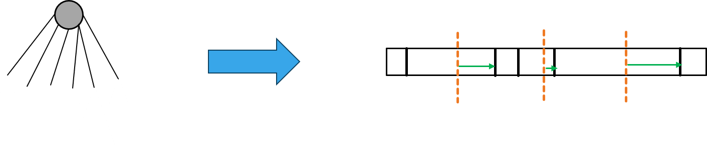
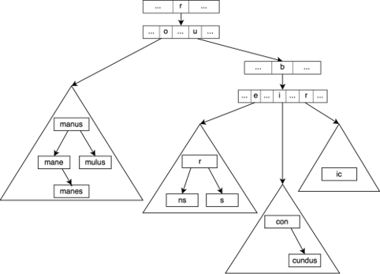
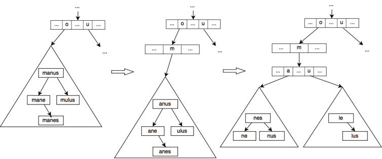
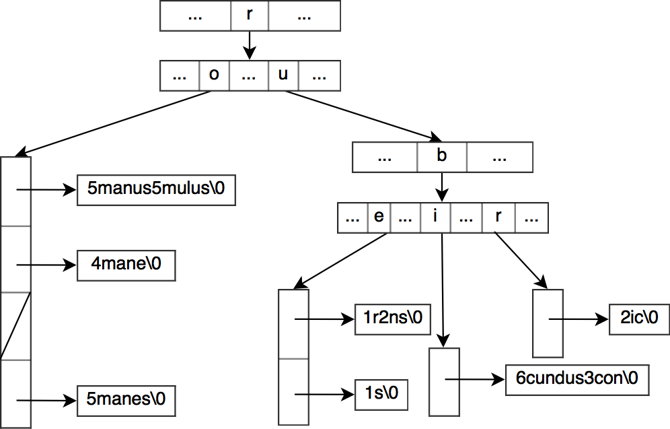

# Trie

 This is an essay I wrote for my data structure class. I hope it will be useful

# Table of contents
- [What is Trie?](#what-is-trie)
  - [Trie Structure](#trie-structure)
  - [simple implementation of Trie](#simple-implementation-of-trie)
- [Disadvantages](#but)
- [Other Data structures](#other-data-structures)
- [Burst-Trie](#burst-trie)
- [Hat-Trie](#hat-trie)
- [DAFSA(DAWG)](#dafsadawg)

# What is Trie?

**Trie** , also known as **prefix tree** , is an m-ary search tree, used
for locating specific keys (specialy strings) from a set. the trie is
traversed depth-first(DFS), in order to find a spesefic key. All the
children of a node have a common prefix of the string associated with
that parent node, and the root is associated with the empty string.

### Trie Structure


### simple implementation of Trie

#### Create a node class

we create a node class and add (children, end of word and word)
properties to it.

``` {.python}
class Node:
    def __init__(self):
        self.children = {}
        self.endOfWord = False
        self.word = None  # added this so that we know if the word is meaningful or not
```

#### Create Trie class

we initialize a node named root. then we implement the insertion and
travers functions.

``` {.python}
class Trie:
    def __init__(self):
        self.root = Node()
```

#### Insertion

``` {.python}
 def insert(self, word):
      ptr = self.root
       for letter in word:
            if letter not in ptr.children:
                ptr.children[letter] = Node()
            ptr = ptr.children[letter]
        ptr.endOfWord = True
```

#### Search (Travers)

``` {.python}
 def search(self, word):
      ptr = self.root
       for letter in word:
            if letter not in ptr.children:
                return False
            ptr = ptr.children[letter]
        if ptr.endOfWord:
            return True
        else:
            return False
```

### Full implementation

``` {.python}
class Node:

    def __init__(self):
        self.children = {}
        self.endOfWord = False
        self.word = None  # added this so that we can know if the node is meaningful or not


class Trie:

    # Trie data structure class
    def __init__(self):
        self.root = Node()

    def insert(self, word):
        ptr = self.root
        for letter in word:
            if letter not in ptr.children:
                ptr.children[letter] = Node()
            ptr = ptr.children[letter]
        ptr.endOfWord = True

    def search(self, word):
        ptr = self.root
        for letter in word:
            if letter not in ptr.children:
                return False
            ptr = ptr.children[letter]
        if ptr.endOfWord:
            return True
        else:
            return False

    def suggestionsRec(self, node, word):
        if node.endOfWord:
            print(word)

        for a, n in node.children.items():
            self.suggestionsRec(n, word + a)

    def startWith(self, word):
        word_list = []
        ptr = self.root
        for letter in word:
            if letter not in ptr.children:
                return False
            ptr = ptr.children[letter]
        if not ptr.children:
            return True
        else:
            self.suggestionsRec(ptr, word)
            return 1

    def __repr__(self):
        return f'< children: {list(self.children.keys())}, word: {self.word} >'


```

### But...

This data structure can be space inefficient, since we create an
individual Node for every single character ! So what can we do?

# PATRICIA Trie

-   Rooted tree : T
-   String: S
-   Length of string: L
-   Total length of string : M
-   The numbers of string stored in the tree : n
-   Size of the alphabet : N

Let S be a string of length L. Trie support insertion or deletion of S
in **O(LN)** time and searching for S in **O(m)** time. If M is the
total length of all string stored in a trie the storage used is
**O(MN)**

  |Method   |Trie    |Patricia Trie|
  |-------- |------- |---------------|
  |Insert   |O(Nm)   |O(Nm)|
  |Delete   |O(mN)   |O(mN)|
  |Search   |O(MN)   |O(MN)|
  |Space    |O(m)    |O(m)|

### Other Data structures

  |Data structure               |Time Complexity   |Space Complexity|
  |---------------------------- |----------------- |------------------|
  |Array                        |O(P)              |O(TΣ)|
  |BST                          |O(P\*logΣ)        |O(T)|
  |Hash Table                   |O(P)              |O(T)|
  |van Emde Boas / Y-fast       |O(P\*loglogΣ)     |O(T)|
  |van Emde Boas + Hash Table   |O(P+loglogΣ)      |O(T)|
  |Weight-Balanced              |O(P\*logK)        |O(T)|

#### K = number of leaves



# Burst-Trie

A burst-trie is a data structure similar to a trie but where the leaves
of the trie are replaced with a container which is able to store a small
number of strings efficiently. The container itself may vary depending
on the implementation. The original paper studies the use of three
containers: a linked list, a binary search tree and a splay tree (which
is a self-balancing binary search tree where frequently accessed nodes
are moved close to the root).


<br> Burst-trie using a binary search tree as container

### Insertion

The burst-trie starts with a single empty container which grows when new
elements are inserted in the trie until the container is deemed
inefficient by a burst heuristic. When this happen, the container is
burst into multiple containers


<br> Burst process after adding the word "romule" when the burst
heuristic limits the size four elements.

The burst heuristic which decides when a container node should be burst
can vary depending on the implementation. The original paper proposes
three options :

-   **Limit** : The most straightforward heuristic bursts the container
    when the number of elements in the container is higher than some
    predefined limit L.

-   **Ratio** : The heuristic assigns two counters to each container
    node. A counter N which is the number of times the container has
    been searched and a counter S which is the number of searches that
    ended successfully at the root node of the container, i.e. a direct
    hit. When the ration S/N is lower than some threshold, the container
    is burst.

-   **Trend** : When a container is created a capital C is allocated to
    the container node. On each successful access, the capital is
    modified. If the access is a direct hit, the capital is incremented
    with a bonus B, otherwise the capital is decremented by a penalty M.
    A burst occurs when the capital reaches 0.

# Hat-Trie

The HAT-trie is essentially a burst-trie that uses an array hash table
as container in its leaf nodes. As with the burst-trie, a HAT-trie
starts with an empty container node which is here an empty array hash
table node. Two approaches are proposed by the paper for the burst:



-   **Pure** : In a way similar to the burst-trie, a new trie node is
    created and takes the spot of the original container node. The first
    letter of each string in the original container is removed and the
    rest of the string is added to a new array hash table which is
    assigned as child of the new trie node at the position corresponding
    to the removed first letter. The process recurses until the new
    array hash tables sizes are below the limit.

-   **Hybrid** : Unlike a pure container node, a hybrid container node
    has more than one parent. When we create new hybrid nodes from a
    pure node, we try to find the split-letter that would split the pure
    node the most evenly in two. The parent will then have its pointers
    for the children corresponding to a letter smaller than the
    split-letter point to the new left hybrid node, the rest to the
    right hybrid node. Note that unlike the pure node, we keep the first
    letter of the original strings so we can distinguish from which
    parent they come from.

#### It\'s:

-   80% faster
-   70% less memory

# DAFSA(DAWG)

(DAFSA) : deterministic acyclic finite state automaton<br>
(DAWG) : directed acyclic word graph

-   Prefix trees handle common prefixes efficiently, but other shared
    word parts are still stored separately in each branch.

-   For example, suffixes, such as -ing and -ion, are common in the
    English language. Luckily, there is a way to store shared word parts
    more economically.

with DAFSA(MA-FSA) you can turn this:


to this:


The most obvious way to build a DA-FSA, as suggested in many web pages,
is to first build the trie, and look for duplicate branches. **But**
trying this on a list of 7 million words even in C++, no matter how hard
you try, makes you keep running out of memory. A trie (or prefix tree)
uses a lot of memory compared to a DAWG. It would be much better if one
could create the DAWG right away, without first creating a trie.

### How to implement DAWG

#### Create DAWG Node class

``` {.python}
class DawgNode:
    NextId = 0

    def __init__(self):
        self.id = DawgNode.NextId
        DawgNode.NextId += 1
        self.final = False
        self.edges = {}

    def __str__(self):
        arr = []
        if self.final:
            arr.append("1")
        else:
            arr.append("0")

        for (label, node) in self.edges.iteritems():
            arr.append(label)
            arr.append(str(node.id))

        return "_".join(arr)

    def __hash__(self):
        return self.__str__().__hash__()

    def __eq__(self, other):
        return self.__str__() == other.__str__()
```

``` {.python}
import sys
import time

DICTIONARY = "/usr/share/dict/words"
QUERY = sys.argv[1:]

# This class represents a node in the directed acyclic word graph (DAWG). It
# has a list of edges to other nodes. It has functions for testing whether it
# is equivalent to another node. Nodes are equivalent if they have identical
# edges, and each identical edge leads to identical states. The __hash__ and
# __eq__ functions allow it to be used as a key in a python dictionary.
class DawgNode:
    NextId = 0

    def __init__(self):
        self.id = DawgNode.NextId
        DawgNode.NextId += 1
        self.final = False
        self.edges = {}

    def __str__(self):
        arr = []
        if self.final:
            arr.append("1")
        else:
            arr.append("0")

        for (label, node) in self.edges.iteritems():
            arr.append(label)
            arr.append(str(node.id))

        return "_".join(arr)

    def __hash__(self):
        return self.__str__().__hash__()

    def __eq__(self, other):
        return self.__str__() == other.__str__()


class Dawg:
    def __init__(self):
        self.previousWord = ""
        self.root = DawgNode()

        # Here is a list of nodes that have not been checked for duplication.
        self.uncheckedNodes = []

        # Here is a list of unique nodes that have been checked for
        # duplication.
        self.minimizedNodes = {}

    def insert(self, word):
        if word < self.previousWord:
            raise Exception("Error: Words must be inserted in alphabetical " +
                            "order.")

        # find common prefix between word and previous word
        commonPrefix = 0
        for i in range(min(len(word), len(self.previousWord))):
            if word[i] != self.previousWord[i]:
                break
            commonPrefix += 1

        # Check the uncheckedNodes for redundant nodes, proceeding from last
        # one down to the common prefix size. Then truncate the list at that
        # point.
        self._minimize(commonPrefix)

        # add the suffix, starting from the correct node mid-way through the
        # graph
        if len(self.uncheckedNodes) == 0:
            node = self.root
        else:
            node = self.uncheckedNodes[-1][2]

        for letter in word[commonPrefix:]:
            nextNode = DawgNode()
            node.edges[letter] = nextNode
            self.uncheckedNodes.append((node, letter, nextNode))
            node = nextNode

        node.final = True
        self.previousWord = word

    def finish(self):
        # minimize all uncheckedNodes
        self._minimize(0)

    def _minimize(self, downTo):
        # proceed from the leaf up to a certain point
        for i in range(len(self.uncheckedNodes) - 1, downTo - 1, -1):
            (parent, letter, child) = self.uncheckedNodes[i]
            if child in self.minimizedNodes:
                # replace the child with the previously encountered one
                parent.edges[letter] = self.minimizedNodes[child]
            else:
                # add the state to the minimized nodes.
                self.minimizedNodes[child] = child
            self.uncheckedNodes.pop()

    def lookup(self, word):
        node = self.root
        for letter in word:
            if letter not in node.edges:
                return False
            node = node.edges[letter]

        return node.final

    def nodeCount(self):
        return len(self.minimizedNodes)

    def edgeCount(self):
        count = 0
        for node in self.minimizedNodes:
            count += len(node.edges)
        return count


dawg = Dawg()
WordCount = 0
words = open(DICTIONARY, "rt").read().split()
words.sort()
start = time.time()
for word in words:
    WordCount += 1
    dawg.insert(word)
    if (WordCount % 100) == 0:
        print("%dr" % WordCount),
dawg.finish()
print "Dawg creation took %g s" % (time.time()-start)

EdgeCount = dawg.edgeCount()
print "Read %d words into %d nodes and %d edges" % (WordCount,
                                                    dawg.nodeCount(), EdgeCount)
print "This could be stored in as little as %d bytes" % (EdgeCount * 4)

for word in QUERY:
    if not dawg.lookup(word):
        print "%s not in dictionary." % word
    else:
        print "%s is in the dictionary." % word
```

### Note

If you have a large word list, you could run it through gzip and get
much better compression. The reason for storing a dictionary this way is
to save space and remain easily searchable, without needing to
decompress it first. Tries and MA-FSAs can support fuzzy search and
prefix queries, so you can do spell checking and auto-completion.

### Note

Because the terminal nodes of a DAFSA can be reached by multiple paths,
a DAFSA cannot directly store auxiliary information relating to each
path, e.g. a word\'s frequency in the English language.

### This lecture was made and gathered by **Ali Haddadi**
